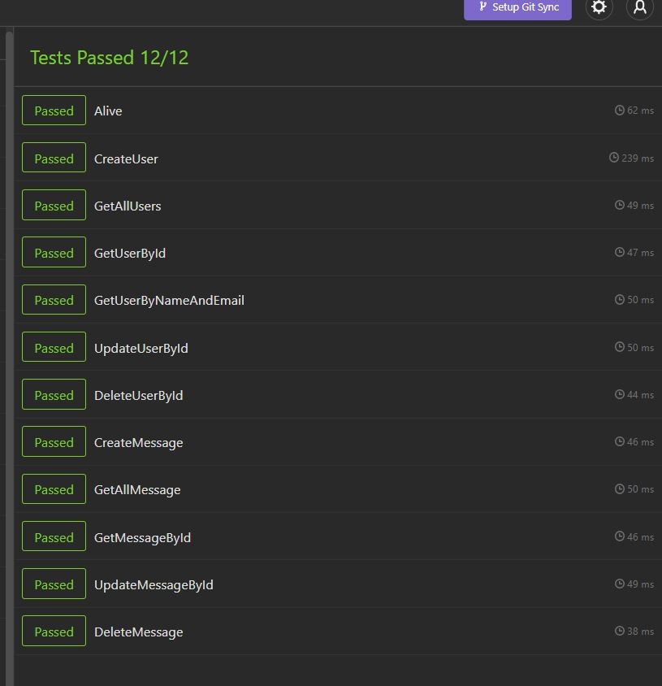
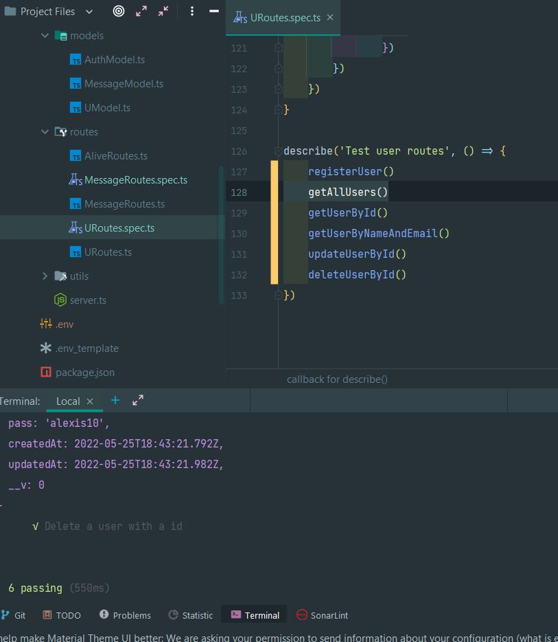
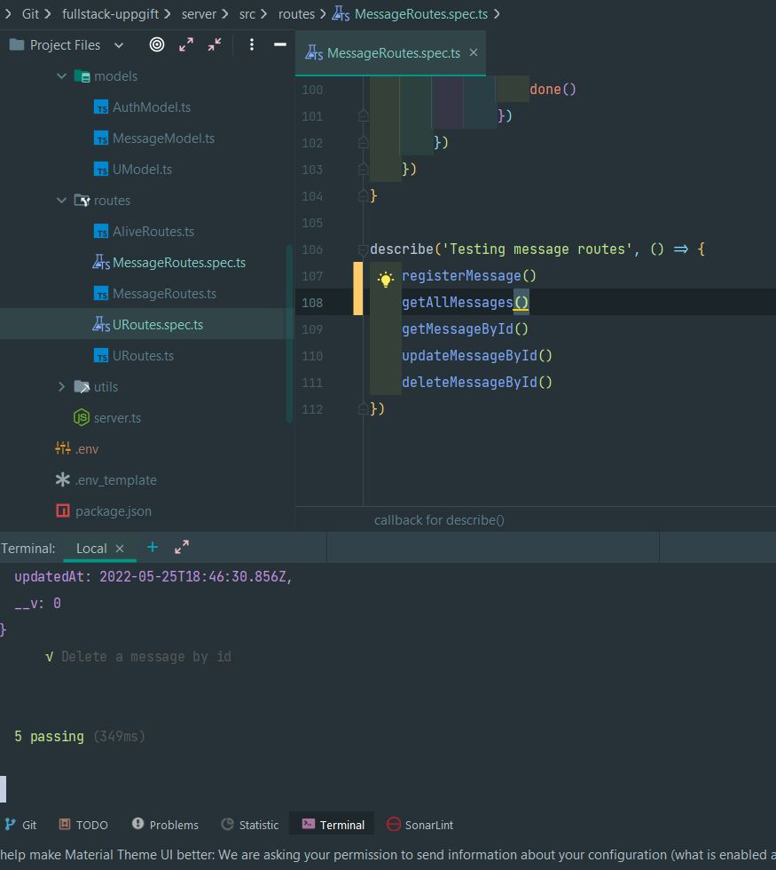

# Kurs: FullStack - Grupp projekt (BookFace)

## SmurfBook by: Aram Mohamed, Emil Haqvinsson och Michaela Andreasson.

## Projektplan:

Vi ska i grupp skapa ett fullStack projekt, ett bookface. Som ska innehålla en databas kopplad till MongoDb och en
Frontend kopplad med React, hela projektet ska vara skrivet i TypeScript.

Vår projektplan hittar du nedan på länken.

[Trello]()

Vi har använt oss av följande npm-paket till vårt arbete:

## Personas:

Projektet är uppbyggt från figurerna "Smurfarna", så vi har inriktat oss till barn upp till 10år. Den ska fungera som en
första sociala medier sida, där det inte finnas mer än att kunna skriva inlägg som delas med andra.

## Wireframes:

Vi har tagit hjälp av draw.io för att skapa våra wireframes. Nedan kan man se hur projektet ser ut i olika lägen. (
mobile, table och desktop.)

För att färgsätta projektet har vi tagit hjälp av färgerna som finns i bilderna, sedan använt colorzilla. Även google
fontz för att hitta en lämplig font att dekorera sidan.

## Genomförande

Arbetet följer SCRUM, vi har planerat in morgonmöten 3 dagar i veckan där vi har checkat av hur vi ligger till, om någon
sitter fast, vad vi behöver jobba vidare med. Det har även varit daglig kommunuikation i vår kanal på Discord. Även
samtal via Google Meet för att kunna dela skärm om vi suttit fast. Vi har även haft avstämningar på tisdagar så vi varit
på plats i skolan.

Projektet har vi delat upp i olika delar, men alla har arbetat på både backend och frontend. Mer om vem som gjort vaad
finns i den individuella dokumentationen.

## Tester:
Testerna för Insomnia, backend och frontend.

### Svårigheter/hinder:

Vi har haft endel konflikter i Github samt gammal kod som skrivits över ny kod. Så våra respektive brancher har inte
altid varit helt uppdaterade med det nya som legat i vår huvudbranch "main". Det har gjort att vi har fått skriva om kod
flera gånger.

Det har även vart krångligt att inplementera kod på frontend, då den inte alltid har velat skrivas ut. Så mycket
felsökande har det blivit.

### Reflektioner: